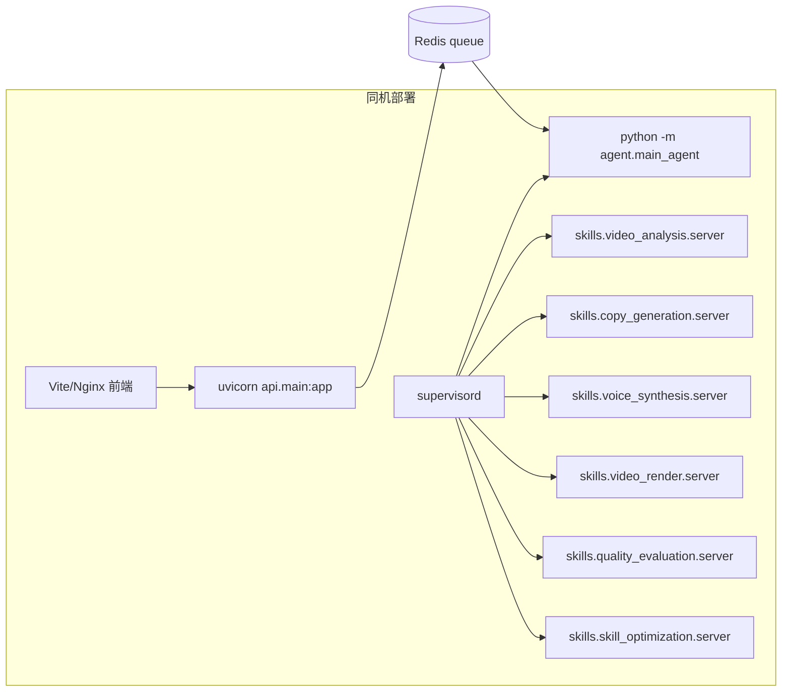
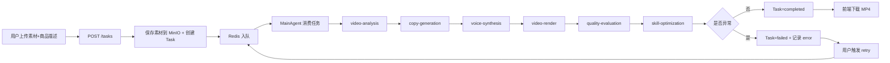
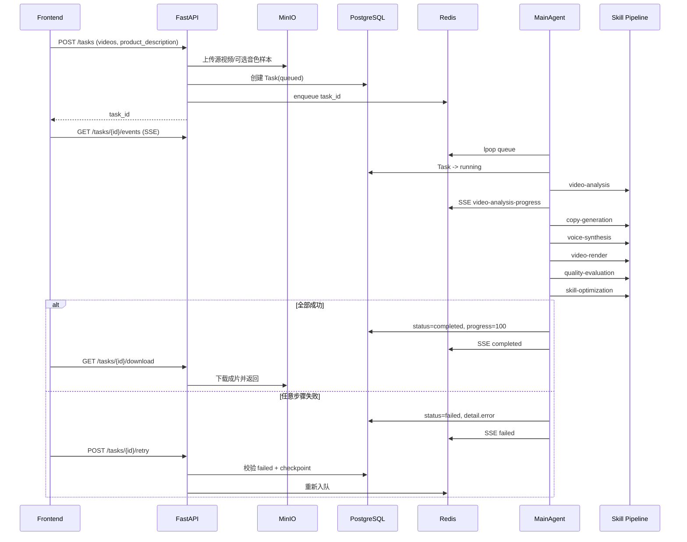
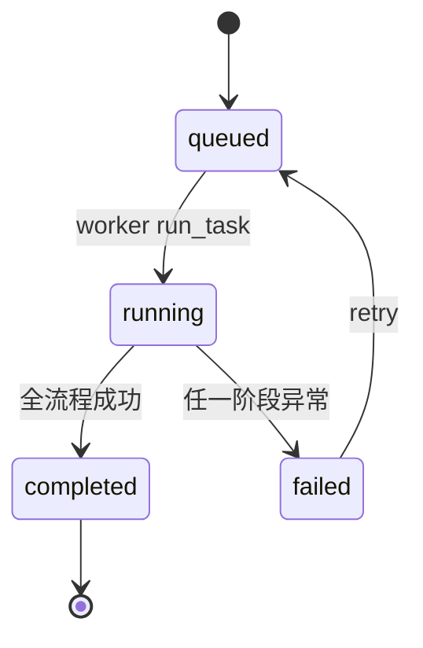
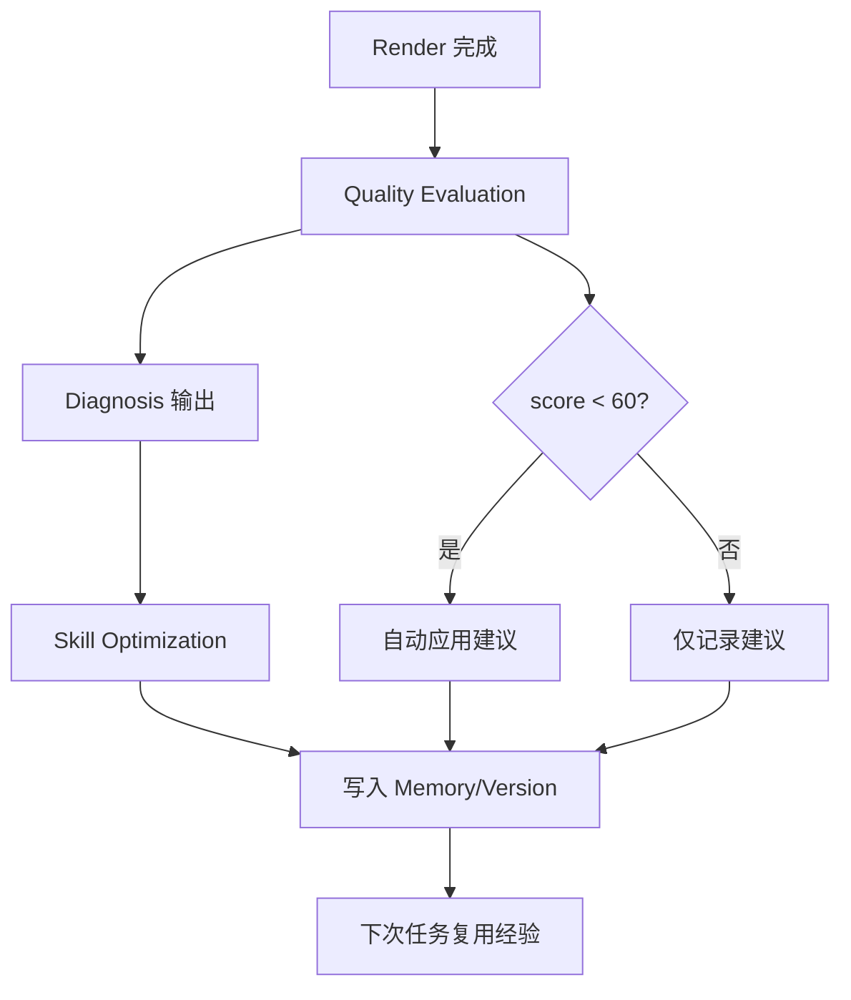
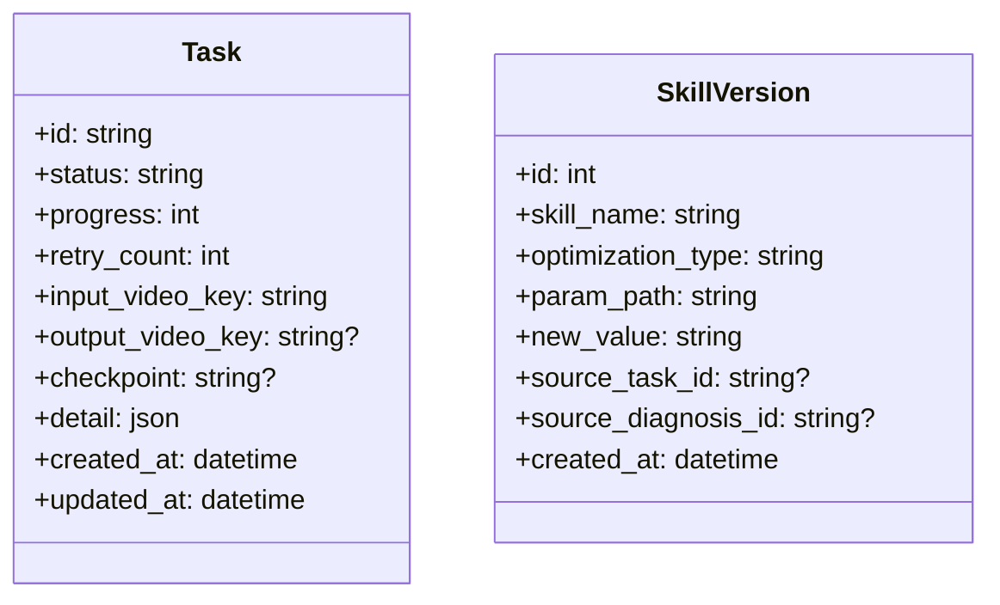
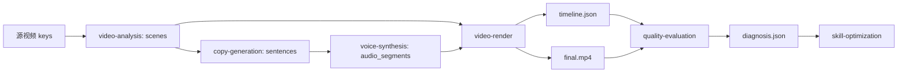
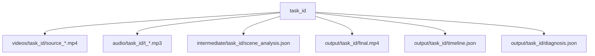
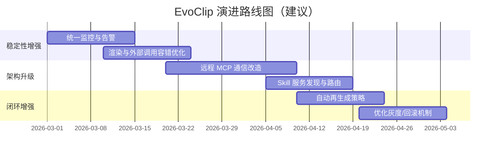

# EvoClip 视频生成系统 - 现状匹配实现方案

> **基于 Agent + Skill + 存储中台的自动化视频生成方案（现状版）**  
> 文档版本：v2.0  
> 更新时间：2026-02-20

---

## 目录

- [一、项目概述](#一项目概述)
- [二、核心概念与边界](#二核心概念与边界)
- [三、系统总体架构（现状）](#三系统总体架构现状)
- [四、核心工作流程](#四核心工作流程)
- [五、Self-Evolve 闭环设计（现状）](#五self-evolve闭环设计现状)
- [六、核心模块详细设计](#六核心模块详细设计)
- [七、数据结构设计](#七数据结构设计)
- [八、接口与协议设计](#八接口与协议设计)
- [九、存储与文件管理](#九存储与文件管理)
- [十、质量保障与测试策略](#十质量保障与测试策略)
- [十一、部署与运维设计](#十一部署与运维设计)
- [十二、风险与应对](#十二风险与应对)
- [十三、路线图与总结](#十三路线图与总结)

---

## 一、项目概述

### 1.1 项目背景

EvoClip 旨在解决电商短视频制作中“人工写文案 + 手动配音 + 手工剪辑”链路长、波动大、产能受限的问题。系统通过用户上传素材视频并输入商品描述，自动完成分析、文案、配音、渲染、质量评估与优化建议。

### 1.2 文档定位

本版本文档是**与当前仓库实现对齐的方案文档**，用于指导：

- 新成员理解系统全链路。
- 产品/研发做需求评审和迭代排期。
- 测试和运维按统一流程验收。

### 1.3 当前阶段目标

| 目标 | 说明 | 当前状态 |
|---|---|---|
| 自动化主链路 | 任务创建后自动执行六阶段流水线 | 已实现 |
| 多素材支持 | 支持多视频输入并统一时间轴 | 已实现 |
| 实时进度 | 前端通过 SSE 实时展示处理状态 | 已实现 |
| 失败恢复 | 失败任务支持 `retry` 手动重试 | 已实现 |
| 基础自优化 | 质量评估 + 优化建议 + 低分自动应用 | 已实现 |
| 自动再生成闭环 | 低分后自动触发新一轮生成 | 未实现 |
| 远程 MCP 动态发现 | 按协议自动发现/路由 Skill 服务 | 未实现（当前本地注册） |

---

## 二、核心概念与边界

### 2.1 核心概念

| 概念 | 当前实现定义 |
|---|---|
| Main Agent | 任务编排器，按固定顺序调用 6 个能力阶段 |
| Skill | 独立功能模块（分析/文案/配音/渲染/评估/优化） |
| MCPClientPool | 本地工具注册与调用池（函数级调用） |
| Checkpoint | 任务执行断点（`tasks.checkpoint` + `tasks.detail`） |
| Diagnosis | 质量评估结果（同步、画面、违禁词、总分） |
| Optimization | 基于诊断的配置/参数优化建议与应用记录 |

### 2.2 “MCP”在当前代码中的边界

当前项目中每个 Skill 都具备 `FastMCP` server 入口，但主流程默认通过 `MCPClientPool.register_tool(...)` 直接注册本地方法调用，而不是远程协议通信。

这意味着：

- 优点：实现简单、联调快、本地稳定。
- 限制：动态发现、跨语言远程扩展、服务治理能力有限。

### 2.3 Self-Evolve 边界

当前已具备的闭环能力：

1. 渲染完成后触发 `quality-evaluation`。
2. 诊断结果触发 `skill-optimization`。
3. 低分（`overall_score < 60`）可自动应用建议，并记录到 `skill_versions`。

当前未覆盖：

- 评估失败后自动重生成。
- 优化建议的灰度发布/审批/回滚策略。

---

## 三、系统总体架构（现状）

### 3.1 逻辑架构图

```mermaid
flowchart TB
    subgraph Client[前端层 Vue3]
        FE1[HomeView: 上传与建任务]
        FE2[TaskView: 进度/预览/下载]
    end

    subgraph API[接口层 FastAPI]
        AP1[POST /tasks]
        AP2[GET /tasks/{id}]
        AP3[GET /tasks/{id}/events]
        AP4[GET /tasks/{id}/download]
        AP5[POST /tasks/{id}/retry]
    end

    subgraph Agent[编排层]
        MA[MainAgent]
        MCP[MCPClientPool]
    end

    subgraph Skills[技能层]
        S1[video-analysis]
        S2[copy-generation]
        S3[voice-synthesis]
        S4[video-render]
        S5[quality-evaluation]
        S6[skill-optimization]
    end

    subgraph Store[数据层]
        PG[(PostgreSQL)]
        RD[(Redis)]
        MI[(MinIO)]
        CH[(ChromaDB)]
    end

    subgraph Ext[外部模型服务]
        LLM[LLM API]
        TTS[TTS API]
        CV[Vision/ASR API]
        EMB[Embedding API]
    end

    FE1 --> AP1
    FE2 --> AP2
    FE2 --> AP3
    FE2 --> AP4
    FE2 --> AP5

    AP1 --> PG
    AP1 --> MI
    AP1 --> RD

    RD --> MA
    MA --> MCP
    MCP --> S1 --> CV
    MCP --> S2 --> LLM
    MCP --> S3 --> TTS
    MCP --> S4
    MCP --> S5
    MCP --> S6 --> LLM
    S6 --> EMB

    S1 --> MI
    S3 --> MI
    S4 --> MI
    S5 --> MI
    S6 --> CH
    MA --> PG
    MA --> RD
    S6 --> PG
```

### 3.2 部署架构图（supervisord 模式）



### 3.3 架构分层职责

| 层级 | 组件 | 职责 |
|---|---|---|
| 前端层 | HomeView/TaskView + Components | 任务发起、进度展示、结果下载 |
| 接口层 | FastAPI routes | 输入校验、文件接入、任务入队、SSE 推送 |
| 编排层 | MainAgent + MCPClientPool | 串联 6 阶段并管理检查点 |
| 技能层 | 6 个 Skill | 完成具体 AI/媒体处理能力 |
| 数据层 | PG/Redis/MinIO/Chroma | 元数据、队列、对象文件、经验记忆 |

---

## 四、核心工作流程

### 4.1 端到端主流程



### 4.2 详细时序图



### 4.3 任务状态机



### 4.4 核心进度映射

| 阶段 | 进度值（约） | 说明 |
|---|---|---|
| video-analysis | 16% | 素材分析（含帧级进度） |
| copy-generation | 33% | 文案生成 |
| voice-synthesis | 50% | 配音生成 |
| video-render | 66% | 渲染合成 |
| quality-evaluation | 83% | 质量评估 |
| skill-optimization | 100% | 优化建议与应用 |

---

## 五、Self-Evolve 闭环设计（现状）

### 5.1 闭环总览



### 5.2 评估维度（已实现）

| 维度 | 实现方式 | 结果字段 |
|---|---|---|
| 音画同步 | 比较 `timeline` 视频段时长与音频时长偏差 | `sync_errors` |
| 画面质量 | 1fps 抽帧检测黑屏/模糊 | `visual_issues` |
| 文案合规 | 扫描字幕违禁词词典 | `prohibited_words` |
| 综合评分 | 规则扣分模型 | `overall_score` |

### 5.3 优化策略（已实现）

- 读取 `diagnosis`，结合 Chroma 相似案例，调用 LLM 生成建议。
- 建议格式：`skill/optimization_type/param_path/new_value/expected_improvement`。
- 低分时自动应用并落库到 `skill_versions`。

### 5.4 现状与目标差异

| 项 | 现状 | 目标 |
|---|---|---|
| 自动再生成 | 手动点击 retry | 低分自动触发并有策略上限 |
| 优化发布 | 直接写配置 | 支持灰度、审批、回滚 |
| 评估方法 | 规则评分 | 规则 + 模型评估组合 |

---

## 六、核心模块详细设计

### 6.1 API 网关层（`api/`）

| 模块 | 职责 | 关键点 |
|---|---|---|
| `api/main.py` | 应用入口与异常处理 | DB 缺失统一转 503 |
| `api/routes/tasks.py` | 任务创建/查询/下载/重试 | 文件上传、Task 管理、队列入队 |
| `api/routes/events.py` | SSE 事件流 | Redis Pub/Sub -> text/event-stream |

### 6.2 编排层（`agent/main_agent.py`）

关键职责：

1. 按阶段顺序执行技能。
2. 每步写入 checkpoint 和 detail。
3. 发布 SSE 事件与进度。
4. 失败兜底（状态改 failed，记录 error）。
5. 心跳检测并尝试重启过期技能进程。

### 6.3 视频分析 Skill（`skills/video_analysis`）

输入：`task_id + video_object_keys`  
输出：`scenes + analysis_metrics + result_path`

核心实现：

- 视频格式与大小校验。
- 按配置抽帧与限帧。
- 视觉模型分析帧描述。
- ASR 转录并按场景对齐。
- 多素材拼接时按偏移统一时间轴。

### 6.4 文案生成 Skill（`skills/copy_generation`）

输入：`product_description + scenes`  
输出：`sentences`

核心实现：

- Prompt 注入场景描述、对象、转录文本。
- 场景引用合法性校验。
- 按场景时长预算裁剪文案。
- 生成 `estimated_duration_s`。

### 6.5 语音合成 Skill（`skills/voice_synthesis`）

输入：`sentences + source_video_keys`  
输出：`audio_segments + ok/failed 统计`

核心实现：

- 支持 DashScope/OpenAI/火山 TTS 适配。
- 支持从参考视频抽取样本并发起音色克隆。
- 单句失败不阻断，最终支持部分成功。
- 记录 `voice_profile_fallback` 供后续渲染统计。

### 6.6 视频渲染 Skill（`skills/video_render`）

输入：`scenes + sentences + audio_segments + source_video_keys`  
输出：`final.mp4 + timeline.json + render_stats`

核心实现：

- 基于场景映射构建时间线。
- 音频适配策略：`speedup/trim/pad_silence/none`。
- 默认 single-pass 渲染，失败回退 legacy pipeline。
- 输出音频处理统计（speedup/trim/pad 次数）。

### 6.7 质量评估 Skill（`skills/quality_evaluation`）

输入：`timeline_path + video_path`  
输出：`diagnosis.json`

核心实现：

- 同步误差检测（容忍阈值来自配置，默认 120ms）。
- 黑屏/模糊检测。
- 违禁词扫描。
- 综合评分计算与结果持久化。

### 6.8 优化 Skill（`skills/skill_optimization`）

输入：`diagnosis`  
输出：`optimizations + retrieved + applied`

核心实现：

- 诊断向量化与历史相似检索。
- LLM 生成优化建议。
- 自动应用阈值逻辑（score < 60）。
- 写入 `SkillVersion` 追踪变更。

### 6.9 存储层（`store/`）

| 模块 | 说明 |
|---|---|
| `database.py` | AsyncSession 生命周期与异常封装 |
| `models.py` | `Task` 与 `SkillVersion` ORM 模型 |
| `redis_client.py` | 队列、进度缓存、SSE 发布 |
| `minio_client.py` | 对象存储读写与预签名 URL |

### 6.10 前端层（`web/src`）

| 模块 | 说明 |
|---|---|
| `views/HomeView.vue` | 商品描述与素材/音色样本上传 |
| `views/TaskView.vue` | 步骤进度、状态切换、失败重试 |
| `composables/useTask.ts` | 任务 API 封装 |
| `composables/useSSE.ts` | SSE 自动重连与事件解析 |
| `components/TaskProgress.vue` | 阶段 UI + 视频分析细粒度进度 |

---

## 七、数据结构设计

### 7.1 关系模型



### 7.2 运行时核心 JSON

| 数据对象 | 关键字段 | 生产阶段 |
|---|---|---|
| scene_analysis | `scene_id,start_ms,end_ms,description,transcription,source_video_key` | video-analysis |
| sentences | `sentence_id,scene_id,text,estimated_duration_s` | copy-generation |
| audio_segments | `sentence_id,audio_path,duration_ms,status` | voice-synthesis |
| timeline | `scene_id,start_ms,end_ms,audio_fit_strategy,subtitle_text,skipped` | video-render |
| diagnosis | `overall_score,sync_errors,visual_issues,prohibited_words` | quality-evaluation |
| optimizations | `skill,param_path,new_value,expected_improvement` | skill-optimization |

### 7.3 数据流转图



---

## 八、接口与协议设计

### 8.1 REST API 设计

| 路径 | 方法 | 入参 | 出参 |
|---|---|---|---|
| `/tasks` | POST | `videos[]/video`, `voice_samples[]`, `product_description` | `{task_id}` |
| `/tasks/{task_id}` | GET | path | TaskReadResponse |
| `/tasks/{task_id}/download` | GET | path | `video/mp4` stream |
| `/tasks/{task_id}/retry` | POST | path | `{task_id}` |
| `/tasks/{task_id}/events` | GET | path | SSE stream |

### 8.2 SSE 事件协议

- 格式：`data: {json}\n\n`
- 关键字段：
  - `status`
  - `progress`
  - `stage`（视频分析细分阶段）
  - `error`

### 8.3 内部调用协议（当前实现）

主 Agent 通过 `MCPClientPool.call_tool(name, **kwargs)` 调用本地注册工具，调用约束：

1. 工具名必须存在，否则抛 `tool_not_found`。
2. 每次调用刷新 `last_seen`，用于过期检测。
3. 异常向上抛至 `run_task` 统一失败处理。

### 8.4 错误处理规范

| 场景 | 错误码/错误信息 | 处理方式 |
|---|---|---|
| DB 缺失 | HTTP 503 + init_db 提示 | API 层兜底 |
| 输入为空 | 400 `empty_*` | 直接返回 |
| 渲染结果非法 | `video_render_invalid_result` | 任务失败 |
| 全部 TTS 失败 | `voice_synthesis_failed:*` | 任务失败 |
| 重试条件不满足 | `task_not_failed/no_checkpoint_available` | 拒绝重试 |

---

## 九、存储与文件管理

### 9.1 MinIO Bucket 设计

| Bucket | 用途 |
|---|---|
| `videos` | 用户上传素材与参考音视频 |
| `audio` | 语音合成片段 |
| `intermediate` | 中间产物（场景分析、克隆样本） |
| `output` | 成片、时间线、诊断结果 |

### 9.2 任务文件组织



### 9.3 PostgreSQL 存储策略

- `tasks.detail` 存放阶段输出摘要与错误信息。
- `tasks.checkpoint` 标识最近成功阶段。
- `skill_versions` 记录优化变更轨迹。

### 9.4 Redis 设计

| Key 类型 | 说明 |
|---|---|
| `task_prefix:queue` | 待执行任务队列 |
| `task_prefix:meta:{task_id}` | 会话元数据（可选） |
| `task_prefix:progress:{task_id}` | 进度缓存 |
| `sse_channel_prefix:{task_id}` | SSE 发布通道 |

---

## 十、质量保障与测试策略

### 10.1 测试分层

| 层级 | 目录 | 覆盖内容 |
|---|---|---|
| API 测试 | `tests/api` | 任务创建、查询、重试、错误处理 |
| Agent 测试 | `tests/agent` | 心跳、失败兜底、关键步骤异常 |
| Skill 单测 | `tests/skills` | 各 Skill 逻辑、容错与边界 |
| E2E 测试 | `tests/e2e` | 全链路跑通与下载验证 |

### 10.2 质量门槛建议

1. 单元与接口测试通过率 100%。
2. E2E 在完整依赖可用时成功。
3. 新增能力需覆盖：正常路径 + 至少 1 条失败路径。
4. 关键配置变更需附回滚方案。

### 10.3 典型测试关注点

- 多素材时序偏移是否正确。
- 音频时长与场景时长适配策略是否符合预期。
- 失败重试是否保留必要上下文并清理错误字段。
- 低分优化自动应用是否写入版本表。

---

## 十一、部署与运维设计

### 11.1 开发环境启动

1. 初始化数据库、存储、Redis。
2. 启动 Agent 与 API。
3. 启动前端 Vite 或部署 `web/dist`。

### 11.2 生产建议

- 使用 `supervisord` 管理多进程，避免单点崩溃造成全链路中断。
- 使用 Nginx 做统一入口，转发 `/api` 并托管前端静态资源。
- 对外部模型调用设置合理超时和重试。
- 落地任务级日志和错误分类统计。

### 11.3 配置治理

- 统一通过 `config/config.yaml` 读取运行参数。
- 建议拆分 `dev/test/prod` 多环境配置。
- 生产环境密钥建议迁移到 Secret 管理系统。

---

## 十二、风险与应对

### 12.1 技术风险

| 风险 | 影响 | 应对策略 |
|---|---|---|
| 外部模型 API 波动 | 流程中断或延迟增加 | 重试 + 降级 + 失败可重试 |
| 大文件与多素材处理压力 | 渲染耗时与资源峰值高 | 限制输入规模 + 分阶段优化 |
| 优化建议直接写配置 | 可能引入错误参数 | 增加灰度/审批/回滚机制 |
| 本地函数式 MCP | 扩展性不足 | 演进为远程 MCP 通信 |

### 12.2 业务风险

| 风险 | 影响 | 应对策略 |
|---|---|---|
| 文案违规 | 合规风险 | 违禁词扫描 + 词库维护 |
| 生成质量不稳定 | 用户体验下降 | 评估指标 + 优化策略闭环 |
| 重试滥用 | 资源占用 | 增加限流和重试策略治理 |

---

## 十三、路线图与总结

### 13.1 迭代路线图（建议）



### 13.2 当前方案结论

1. EvoClip 已形成完整可运行的自动化视频生成主链路，前后端协同闭环清晰。
2. 当前版本核心价值在于“可执行、可观测、可重试、可优化”，适合持续迭代。
3. 下一阶段重点应从“功能可用”转向“架构可扩展 + 策略可治理 + 质量可度量”。

---

> 本文档已按当前代码实现纠偏更新。后续若接口、状态机、Skill 顺序、评分规则或存储模型发生变化，应同步更新本方案文档。
