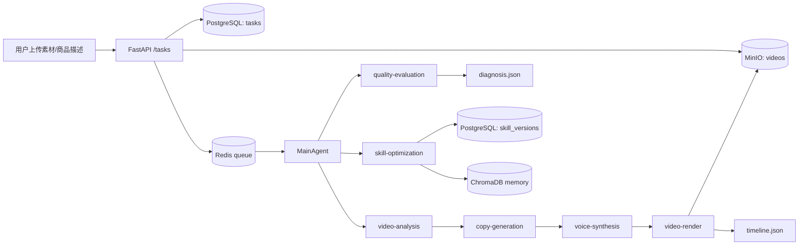
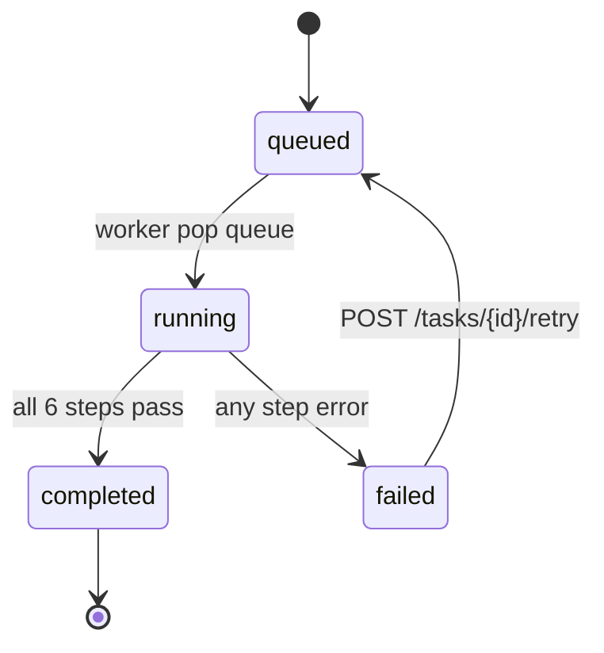
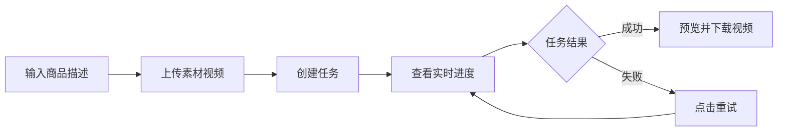
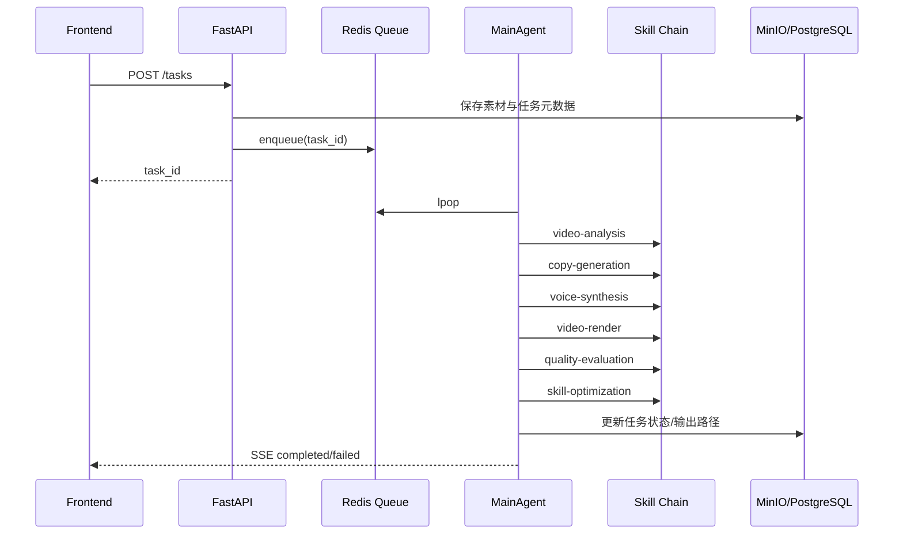

# EvoClip 项目需求分析文档

> 文档版本：v1.0  
> 更新时间：2026-02-20  
> 适用范围：`/home/lwk/ai-code/EvoClip` 当前代码基线

---

## 一、文档目标

本文档用于沉淀 EvoClip 当前版本（前后端一体化项目）的**真实需求边界**，并为后续方案设计、迭代排期和验收提供统一依据。

本文档强调两点：

1. 需求必须与当前代码实现一致，避免“理想化设计”脱离实际。
2. 需求同时区分“已实现能力”和“待补齐能力”。

---

## 二、项目背景与目标

### 2.1 业务背景

EvoClip 面向电商短视频生产场景，通过上传素材视频与商品描述，自动生成营销视频，降低人工剪辑成本。

### 2.2 目标定义（当前阶段）

| 目标编号 | 目标描述 | 衡量方式 |
|---|---|---|
| G1 | 自动完成视频生成主链路 | 从 `POST /tasks` 到可下载 MP4 |
| G2 | 支持多素材输入并生成连贯时间线 | 渲染输出含 `timeline.json` 且可下载 |
| G3 | 提供过程可观测性 | 前端可通过 SSE 实时看到阶段进度 |
| G4 | 失败后可恢复 | 支持 `POST /tasks/{id}/retry` 重试 |
| G5 | 具备基础自优化闭环 | 生成后自动执行质量评估和优化建议 |

### 2.3 非目标（当前版本）

| 非目标编号 | 当前不覆盖项 |
|---|---|
| NG1 | 抖音平台自动发布与投放管理 |
| NG2 | 多租户账号体系与权限系统 |
| NG3 | 人工在线逐镜头编辑器 |
| NG4 | 全自动“评估失败后自动再生成”闭环 |
| NG5 | 真正远程动态 MCP Server 发现与路由治理 |

---

## 三、现状基线（As-Is）

### 3.1 前端基线

- 技术栈：Vue 3 + TypeScript + Vite + TailwindCSS + Vue Router + Axios。
- 页面：
  - `/` 首页：商品描述、素材上传、可选参考音色视频上传。
  - `/task/:id` 任务页：步骤进度、视频预览、失败重试、结果下载。
- 交互：
  - 任务创建调用 REST API。
  - 任务进度依赖 SSE 自动刷新。

### 3.2 后端基线

- 技术栈：FastAPI + SQLAlchemy + AsyncPG + Redis + MinIO + ChromaDB。
- 编排中心：`agent/main_agent.py`。
- 流程顺序：
  1. `video-analysis`
  2. `copy-generation`
  3. `voice-synthesis`
  4. `video-render`
  5. `quality-evaluation`
  6. `skill-optimization`
- 存储职责：
  - PostgreSQL：任务与 Skill 版本记录。
  - Redis：队列、SSE 事件、进度缓存。
  - MinIO：素材、音频、中间产物、输出视频。
  - ChromaDB：优化记忆检索。

### 3.3 已落地关键能力

- 多素材上传（`videos[]`）与兼容单文件上传（`video`）。
- 任务状态机：`queued/running/failed/completed`。
- 检查点机制（`checkpoint` + `detail`）与失败重试。
- 视频分析阶段支持帧级进度事件。
- 渲染支持 single-pass 与 legacy fallback。
- 质量评估包含同步、画面、违禁词检查。
- 优化模块支持建议生成、低分自动应用、版本落库。

---

## 四、角色与业务场景

### 4.1 角色定义

| 角色 | 目标 |
|---|---|
| 运营/内容人员 | 快速生成可用带货视频，减少剪辑成本 |
| 开发与测试 | 确保流程稳定、可观测、可回放、可重试 |
| 运维 | 确保基础设施可用与服务可恢复 |

### 4.2 核心场景

| 场景编号 | 场景描述 | 成功判定 |
|---|---|---|
| S1 | 用户上传 1~10 个素材并创建任务 | 返回 `task_id`，任务入队 |
| S2 | 用户查看任务处理状态 | 页面阶段与进度持续更新 |
| S3 | 任务完成后下载成片 | 可下载 `video/mp4` |
| S4 | 任务失败后重试 | 不重新上传素材即可重跑 |
| S5 | 生成后自动评估与优化 | 产生 `diagnosis` 与 `optimizations` 结果 |

---

## 五、功能需求（Functional Requirements）

### 5.1 需求列表

| 编号 | 需求描述 | 优先级 | 当前状态 |
|---|---|---|---|
| FR-01 | 支持素材视频上传（MP4/MOV，单文件 ≤ 500MB） | P0 | 已实现 |
| FR-02 | 支持多素材合并分析与统一时间线偏移 | P0 | 已实现 |
| FR-03 | 支持输入商品描述，禁止空白提交 | P0 | 已实现 |
| FR-04 | 创建任务后写入 DB、上传 MinIO、入 Redis 队列 | P0 | 已实现 |
| FR-05 | 后端主 Agent 按固定六阶段流水线执行 | P0 | 已实现 |
| FR-06 | 前端通过 SSE 接收任务状态与分析进度 | P0 | 已实现 |
| FR-07 | 任务详情页支持下载成片 | P0 | 已实现 |
| FR-08 | 任务失败后支持手动重试并累计 `retry_count` | P0 | 已实现 |
| FR-09 | 支持音色参考视频上传并用于语音克隆 | P1 | 已实现 |
| FR-10 | 质量评估输出结构化诊断结果 | P1 | 已实现 |
| FR-11 | 技能优化输出建议并按阈值自动应用 | P1 | 已实现 |
| FR-12 | 支持步骤检查点记录与断点续跑 | P1 | 已实现 |
| FR-13 | 支持评估失败后自动触发再生成 | P2 | 未实现 |
| FR-14 | 支持动态发现远程 MCP Skill 服务 | P2 | 未实现（当前为本地注册） |

### 5.2 关键规则

| 规则编号 | 规则描述 |
|---|---|
| R-01 | `product_description` 为空时返回 `400 empty_product_description` |
| R-02 | 未上传视频时返回 `400 empty_video_files` |
| R-03 | 重试仅允许 `failed` 状态且 `checkpoint` 非空 |
| R-04 | 渲染阶段若无可用音频分段，任务失败并记录错误 |
| R-05 | 质量分 = `100 - 10*sync_errors - 15*visual_issues - 20*prohibited_words`（下限 0） |
| R-06 | 优化自动应用条件：`overall_score < 60` |

---

## 六、非功能需求（Non-Functional Requirements）

### 6.1 性能需求

| 编号 | 需求项 | 目标 |
|---|---|---|
| NFR-P-01 | 任务创建接口响应 | 常规网络下 < 3s（不含后处理） |
| NFR-P-02 | SSE 时效 | 关键阶段事件秒级可见 |
| NFR-P-03 | 视频分析并发 | 帧分析并发可配置（当前默认 3） |

### 6.2 稳定性与可恢复

| 编号 | 需求项 | 目标 |
|---|---|---|
| NFR-R-01 | 外部模型调用失败容错 | 支持重试与局部降级 |
| NFR-R-02 | 任务失败可恢复 | 手动重试不需重复上传 |
| NFR-R-03 | 进程级故障恢复 | 支持 `supervisord` 自动拉起 |

### 6.3 安全与合规

| 编号 | 需求项 | 目标 |
|---|---|---|
| NFR-S-01 | 文案合规检查 | 内置违禁词扫描 |
| NFR-S-02 | 凭据管理 | 配置化管理（建议生产改为 Secret 注入） |
| NFR-S-03 | 数据访问最小化 | 仅通过 API/存储客户端访问对象与元数据 |

### 6.4 可观测性

| 编号 | 需求项 | 目标 |
|---|---|---|
| NFR-O-01 | 任务状态可追踪 | DB 中可查询 `status/progress/checkpoint/detail` |
| NFR-O-02 | 运行阶段可追踪 | SSE 事件流反映当前阶段 |
| NFR-O-03 | 质量结果可追踪 | MinIO 持久化 `diagnosis.json` |

---

## 七、数据需求

### 7.1 核心实体

| 实体 | 关键字段 | 说明 |
|---|---|---|
| Task | `id, status, progress, retry_count, checkpoint, detail` | 任务主记录 |
| SkillVersion | `skill_name, optimization_type, param_path, new_value` | 优化版本留痕 |
| Scene | `scene_id, start_ms, end_ms, source_video_key` | 视频分析输出 |
| Sentence | `sentence_id, scene_id, text` | 文案分句输出 |
| AudioSegment | `sentence_id, audio_path, duration_ms, status` | 配音输出 |
| TimelineItem | `scene_id, start_ms, end_ms, audio_fit_strategy` | 渲染时间轴 |
| Diagnosis | `overall_score, sync_errors, visual_issues, prohibited_words` | 质量诊断 |

### 7.2 数据流转图

---

## 八、接口需求

### 8.1 REST 接口

| 接口 | 方法 | 说明 | 关键返回 |
|---|---|---|---|
| `/tasks` | POST | 创建任务并入队 | `task_id` |
| `/tasks/{task_id}` | GET | 查询任务状态 | `status/progress/detail` |
| `/tasks/{task_id}/download` | GET | 下载成片 | `video/mp4` 流 |
| `/tasks/{task_id}/retry` | POST | 重试失败任务 | `task_id` |
| `/tasks/{task_id}/events` | GET | SSE 状态流 | `data: {...}` |

### 8.2 任务状态机需求

### 8.3 SSE 事件需求

| 事件类型 | 说明 |
|---|---|
| `queued/running/completed/failed` | 任务状态事件 |
| `video-analysis-progress` | 视频分析阶段细粒度事件 |
| `heartbeat` | 技能心跳事件 |
| `restart_*` | 技能重启相关事件 |

---

## 九、核心业务流程需求

### 9.1 用户主流程

### 9.2 后端核心处理流程

---

## 十、前后端协同需求

| 协同点 | 前端职责 | 后端职责 |
|---|---|---|
| 任务创建 | 组装 `FormData`（videos + product_description + voice_samples） | 校验输入、上传对象、建任务、入队 |
| 进度展示 | SSE 订阅并渲染步骤条 | 发布阶段事件与进度 |
| 失败恢复 | 提供重试按钮并复位页面状态 | 校验可重试条件并重新入队 |
| 成果交付 | 预览与下载 | 提供 `download` 文件流 |

---

## 十一、差距分析（目标架构 vs 当前实现）

| 差距项 | 当前状态 | 影响 | 建议优先级 |
|---|---|---|---|
| 真正 MCP 远程调用与动态发现 | 当前为 `MCPClientPool` 本地函数注册 | 可扩展性受限 | P1 |
| 评估失败自动重生成 | 未实现 | 需要人工点击重试 | P1 |
| 优化策略细粒度治理（灰度/回滚） | 仅记录版本，不含发布策略 | 线上风险控制不足 | P1 |
| 统一监控面板 | 未形成完整指标看板 | 运维可观测不足 | P2 |
| 多租户与权限 | 未实现 | 仅适合单团队内部 | P2 |

---

## 十二、验收标准

### 12.1 功能验收

1. 能成功创建任务并看到状态流转：`queued -> running -> completed/failed`。
2. 成功任务可下载 MP4，且 `detail` 含关键阶段产物信息。
3. 失败任务可通过 `retry` 重跑，`retry_count` 递增。
4. 质量评估输出含 `overall_score` 与三类问题明细。
5. 优化模块在低分场景可产生 `applied` 记录。

### 12.2 质量验收

1. 单元测试、接口测试通过。
2. E2E 在依赖齐备时可跑通（`EVOCLIP_E2E=1`）。
3. 关键错误可从日志和任务明细定位到失败步骤。

---

## 十三、下一阶段需求建议

1. 将本地函数注册式 MCP 升级为真正协议通信与服务发现。
2. 增加“评估低分自动触发重生成”策略与重试上限治理。
3. 补齐优化策略发布机制（灰度、回滚、审批）。
4. 建立统一观测面板（成功率、平均时长、失败分布、质量分趋势）。
5. 增加前端历史任务列表与诊断可视化页面。

---

> 本需求文档为当前代码实现基线的分析结果，后续若流程、接口、数据结构变化，应同步更新本文件并重新评审。
